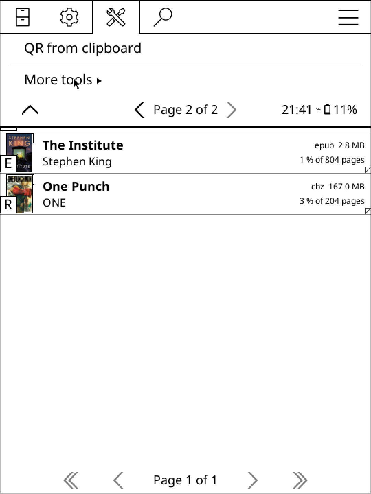
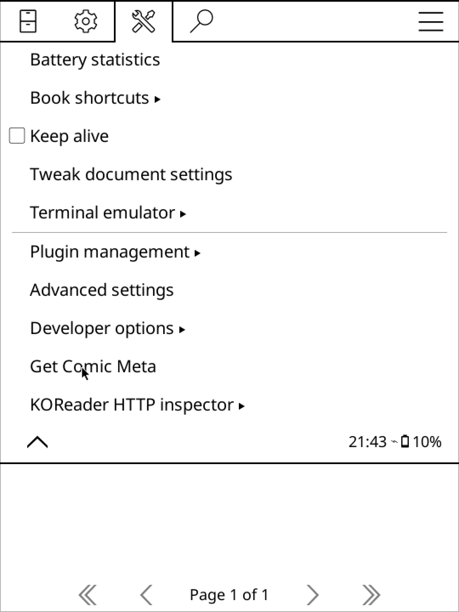

# Getting Started

This guide will walk you through the installation and usage of ComicMeta.

## Installation

Follow these simple steps to get started:

1. Head over to the [releases page](https://github.com/KORComic/comicmeta.koplugin/releases/latest) and grab the latest `.zip` file.
2. Unzip the contents into your **plugins** folder.
3. In the file browser, go to More Tools:
   
   Then tap "Get Comic Meta":
   

## Usage

When you open a directory, the plugin will ask whether to extract recursively. If you choose Yes, all CBZ files in that directory and its subdirectories will be processed. If you choose No, only the CBZ files in the current directory will be processed.
